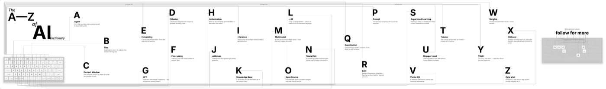
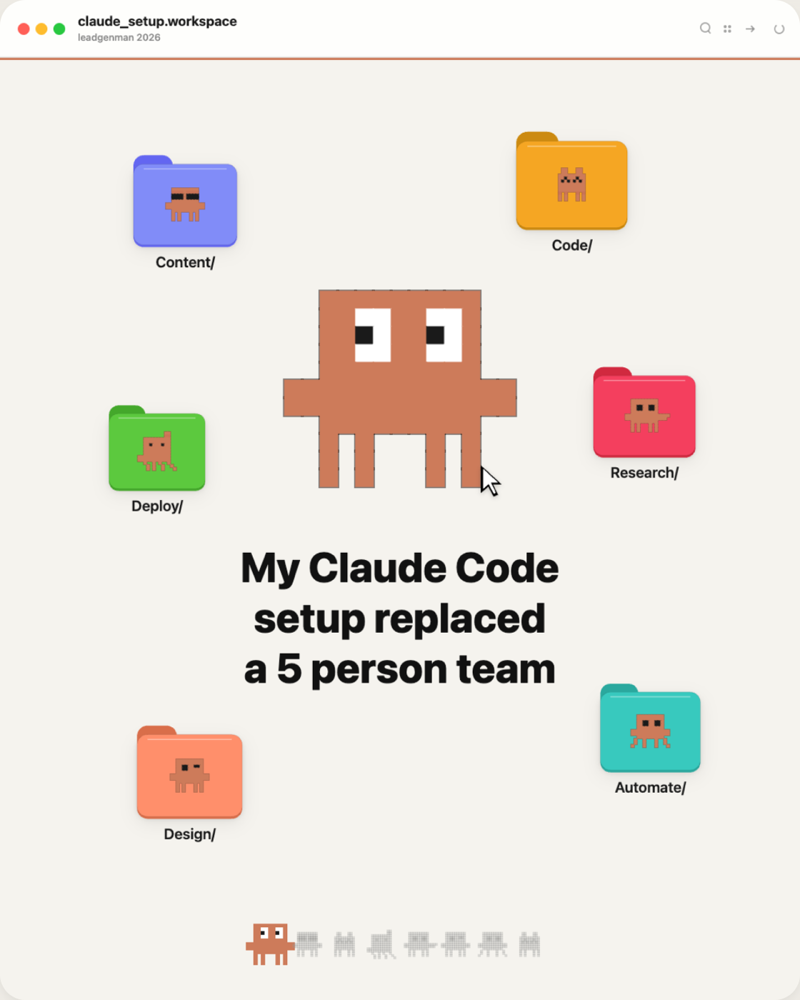
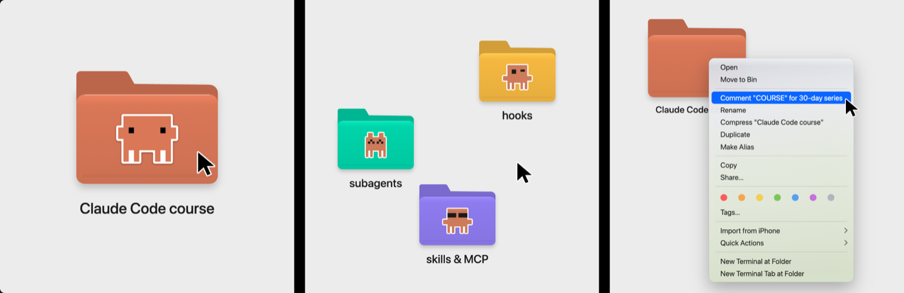

<div align="center">

# 📁 Claude Code Content OS

### The markdown folder that writes and schedules my Instagram carousels without me logging in.

**5 context files → 3 slash commands → one carousel file per run → approve → schedule**


**By Manthan Patel ([@LeadGenMan](https://www.youtube.com/@LeadGenMan))**

🔗 [LinkedIn](https://www.linkedin.com/in/leadgenmanthan/) • 📸 [Instagram](https://www.instagram.com/leadgenman/) • 🎥 [YouTube](https://www.youtube.com/@LeadGenMan) • 🎵 [TikTok](https://www.tiktok.com/@leadgenmanthan) • 🎓 [Skool Community](https://www.skool.com/ai-inner-circle/about) • 🎬 [TiltIt](https://tiltit.video) • ✏️ [PenAnywhere](https://apps.apple.com/us/app/penanywhere/id6760774183) • 🗣️ [Impromptly AI](https://impromptly.ai/)

</div>

---

### 🎓 Join the Community

Get help setting this up, share what your version of the folder produces, and learn how I run content and client acquisition with AI, with me and 1000s of others inside the **AI Inner Circle**.

> **[👉 Join the AI Inner Circle on Skool](https://www.skool.com/ai-inner-circle/about)**

---

## What this is

A plain folder of markdown files that Claude Code reads before it writes anything as me. No app, no database, no prompt library sitting in a Notion page. Who I am, what I sell, what worked this quarter and how I talk all live in five context files at the root. One slash command reads them, picks a carousel type, scores the cover hooks and writes every slide in my voice. The output lands in `content/carousels/` as one dated file per carousel. I read it, reply approved, and a second command takes it to scheduling.

The commands are short. The context is where the weight lives. That's the whole idea.

## How it works

```
/carousel "your idea in one sentence"
    |
    v
reads the 5 context files + systems/brand-voice.md
    |
    v
picks 1 of 8 carousel types (systems/carousel-types.md)
    |
    v
writes 3 cover hooks, scores each on the 20-point rubric
    |   17+ ships, 14 to 16 gets rewritten, 13 or below gets binned
    v
builds every slide in my voice, 2 pattern interrupts, CTA from offers.md
    |
    v
content/carousels/<date>-<slug>.md   (status: draft)
    |
    v
I read it -> reply "approved" -> /schedule renders at 4x and books the slot
```

## Folder structure

```
leadgenman-os/
├── CLAUDE.md                     # read first every session, load order, hard rules
├── README.md                     # this file
├── LICENSE                       # MIT
├── personal-info.md              # who I am, audience table, values, how to write as me
├── business-info.md              # brand, offers, platforms, revenue, tech stack, public repos
├── offers.md                     # every offer, price, keyword style, which content plugs which
├── strategy.md                   # pillars, net new value filter, weekly calendar, funnel
├── current-data.md               # the only numbers allowed in copy, refreshed monthly
├── .claude/
│   └── commands/
│       ├── carousel.md           # /carousel: idea in, one carousel file out, stops for approval
│       ├── hooks.md              # /hooks: ten hooks, scored, top three back
│       └── schedule.md           # /schedule: lint, render, pick slot, book, write back
├── systems/
│   ├── brand-voice.md            # voice rules, banned phrases, written-to-spoken swaps
│   ├── carousel-design-system.md # format, colour, type, shadows, families, cover and CTA rules
│   ├── carousel-types.md         # the eight types, slide skeletons, CTA matching
│   └── hook-rubric-20pt.md       # ten criteria, thresholds, worked example
├── references/
│   ├── instagram-2026-playbook.md # what moves reach on Instagram right now, from my own data
│   ├── swipe-file.md             # format notes on reels I studied, frames only, never words
│   └── winning-patterns.md       # reel and carousel structures I reuse, with beat maps
├── content/
│   └── carousels/                # output, one dated markdown file per carousel
│       ├── 2026-09-18-claude-code-slash-commands.md
│       └── 2026-09-20-ai-tools-i-pay-for.md
├── archives/
│   └── README.md                 # what moves here after posting, naming, rules
├── docs/
│   └── screenshots/              # the three example carousels below
└── examples/
    └── carousels/                # Next.js app that renders the three live carousels
```

## The five context files

| File | What it holds | What to rewrite for yourself |
|---|---|---|
| `personal-info.md` | Name, the creator who codes framing, audience table with live follower counts, what I post, values, how I like to work, how to address me and write as me | Everything. Your name, your platforms and numbers, your values, your rules for how you want to be written |
| `business-info.md` | Brand colours, what I sell with prices, community details, newsletter, sponsorship rates, revenue streams, products, tech stack, public repos | Your brand, your products, your prices. Delete the rows you don't have, don't leave mine in |
| `offers.md` | The comment keyword CTA mechanic, every offer with positioning lines, the table of which offer plugs which content type | Your offers and the keyword style for each. If you sell nothing yet, keep one row for your newsletter or your follow |
| `strategy.md` | Content pillars, the three-gate net new value filter, platform priorities, content mix, weekly calendar, the funnel, 90-day targets, what I never do | Your pillars, your calendar, your never list. `/schedule` reads the calendar to pick a slot |
| `current-data.md` | Follower counts, owned channels, rate card, top formats this quarter, audit baseline, CTA keywords in rotation, topics that die | Your numbers. This is the only file copy is allowed to quote from, so keep it honest and refresh it monthly |

## The slash commands

| Command | What it does | Output |
|---|---|---|
| `/carousel <idea>` | Loads all five context files plus the voice, design, types and rubric files. Runs the idea through the net new value filter. Picks one carousel type, plans every slide, writes three cover hooks and scores them on the 20-point rubric. Builds each slide with headline, body and visual note, places two pattern interrupts, ends with the CTA from `offers.md`, writes a 500+ word caption. Stops for approval | `content/carousels/YYYY-MM-DD-<slug>.md` with status draft |
| `/hooks <idea>` | Writes ten cover hooks across ten angles, scores every one on all ten criteria, sorts them, returns the top three with each one's weakest criterion and the fix. Writes a second set if none reaches 17 | Printed in the session, nothing written to disk |
| `/schedule <file>` | Gates the file: status approved, one keyword in curly quotes, offer matches `offers.md`, every number exists in `current-data.md`, caption over 500 words with zero hashtags, copy lint. Renders every slide through the design system at 4x, picks the next open slot from the calendar in `strategy.md`, sends it to the scheduler, writes the confirmation back into the file | Same file with status scheduled, plus `exports/<slug>/` |

## Install (5 minutes)

```bash
git clone https://github.com/manthanpatelll/leadgenman-os.git
cd leadgenman-os
claude
```

Then, inside Claude Code:

1. Rewrite `personal-info.md`, `business-info.md`, `offers.md`, `strategy.md` and `current-data.md` as yourself. Every line in those five files is about me right now. Run the command before rewriting them and you get a carousel about me, not about you.
2. Run `/carousel your idea in one sentence`.
3. Open the new file in `content/carousels/`, read every slide, reply `approved` or `change <your notes>`.
4. Run `/schedule content/carousels/<the file>.md`.

`/schedule` describes the step end to end: lint the copy, render the slides, pick the slot, send to the scheduler, write the confirmation back. Where it says Instagram scheduler, plug in the one you use. Nothing in this folder posts on its own, and nothing moves past draft without your reply.

## Design system and hook rubric

Every slide obeys `systems/carousel-design-system.md`: 1080 x 1350 per slide, an 8px grid, the 60-30-10 colour split, cream backgrounds instead of flat white, a two-layer shadow under every card, and five design families (Finder, VS Code mockup, editorial steps, category cards, seamless canvas) where you pick one per carousel and never mix. `systems/carousel-types.md` holds the eight carousel types with a slide skeleton and a CTA style for each, so the command never has to invent a structure on the spot.

Every cover hook is scored in `systems/hook-rubric-20pt.md` before a single slide gets built. Ten criteria at zero to two each: specific, curiosity gap, power word, who it's for, payoff clarity, fresh angle, scroll readability, proof signal, voice match and format signal. Seventeen or above ships, fourteen to sixteen gets its two weakest criteria rewritten and rescored once, thirteen or below gets thrown out. `systems/brand-voice.md` is the file every line runs through last: contractions, second person, one idea per sentence, a banned phrase table and a written-to-spoken swap list.

## Live carousel examples

Three carousels that came out of this system, rendered on Canvas 2D by the small Next.js app in `examples/carousels/`. Each one is live, and all three run locally with `cd examples/carousels && npm install && npm run dev`.

### AI Dictionary



A to Z of AI terms drawn on one seamless keyboard canvas, split into nine slides so every swipe cuts through a letter or a key. Nine slides, 1080 x 1440 each. [Open it live](RAILWAY_URL/ai-dictionary)

### My Claude Code Setup That Replaced a 5-Person Team



A macOS Finder window with one coloured folder per job my setup took over, the mascot on every folder, the hook in the top half so it survives the grid crop. Eight slides, 1080 x 1350 each. [Open it live](RAILWAY_URL/claude-replaced-team)

### Claude Code Finder Folders



A hero folder, a real macOS right-click menu with the keyword CTA sitting on the highlighted row, then three feature folders. Three slides, 1080 x 1080 each. [Open it live](RAILWAY_URL/claude-code-folders)

Source for all three lives in [`examples/carousels/`](examples/carousels/).

## Make it yours

- `personal-info.md` first. Your name, your audience table with live numbers, your values, how you want to be addressed. This one file does most of the voice work.
- `offers.md` second. The CTA slide reads straight from its table, so an empty table means an empty CTA. One row is enough to start.
- `current-data.md` every month. Only numbers in this file are allowed in copy. Stale file, stale carousel.
- The colour blocks in `systems/carousel-design-system.md`. Swap my cream background and accent set for your palette. Keep the shadow, grid and safe zone rules, they're what make the slides read as finished.
- The weekly calendar in `strategy.md`. Which carousel type goes out on which day is the one thing `/schedule` needs from you before it can pick a slot.

## FAQ

**Does this post for me?**
No. `/carousel` writes a file and stops. `/schedule` only runs on a file you've marked approved, and it hands the finished slides to whatever scheduler you wire in. Nothing goes out without you reading it first.

**Which model?**
Whatever your Claude Code is set to. I run the default. The files are plain markdown, so the model is not the point, the context is.

**Do I need the design system?**
Keep the file, because `/carousel` reads it for the visual note on every slide. The copy, the hook scores and the caption don't depend on my palette though, so swap the colour blocks for your brand and leave the rest as it is until you want to change how the slides are built.

**Can I use it for LinkedIn?**
Yes. `/schedule` already exports a PDF version for LinkedIn, and `offers.md` has a LinkedIn carousel row. Change the platform priorities in `strategy.md` and the calendar follows.

---

<div align="center">

**Built by [Manthan Patel](https://www.instagram.com/leadgenman/)**

Questions, results, or your own version of the folder: bring them to the [AI Inner Circle](https://www.skool.com/ai-inner-circle/about).

MIT License

</div>
